# Systems Neuroecology

We are excited to announce our [Systems Neuroecology seminar series](https://www.worldwideneuro.com/seminar-series.html?name=Systems_Neuroecology) - bringing together a community of researchers interested in questions that span behavioral ecology, ethology, and systems neuroscience! Talks take place roughly every other **Wednesday starting at 12 noon EST.**

## Organizers:

[Sama Ahmed](https://twitter.com/ColumboAhmed)
 | [Adam Calhoun](https://twitter.com/neuroecology)
  | [Emily Jane Dennis](https://twitter.com/emilyjanedennis)
   | [Ahmed El Hady](https://twitter.com/zamakany)

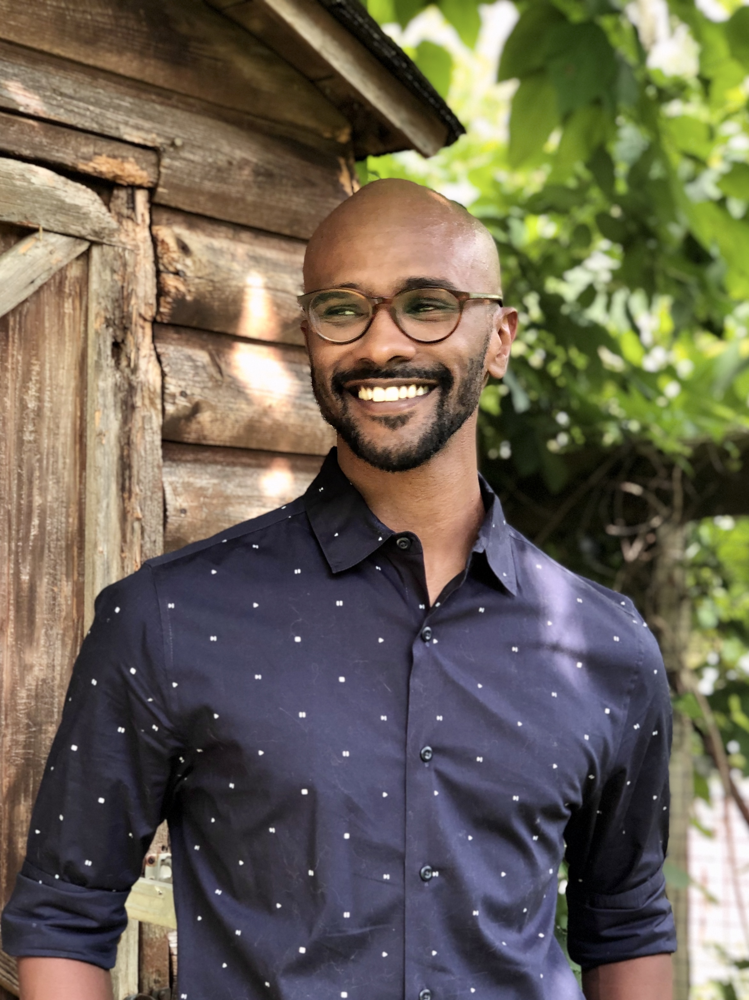  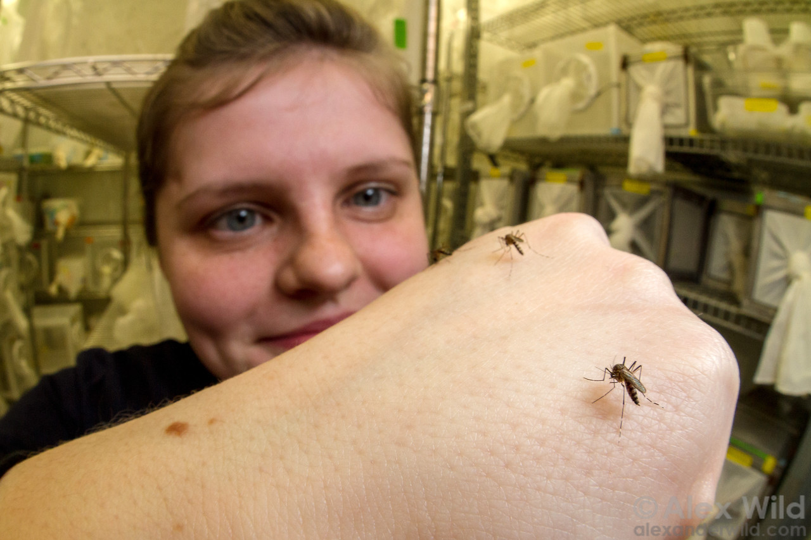 

## 2021 Speakers

### January 13, 2021
**Dr. Orit Peleg**

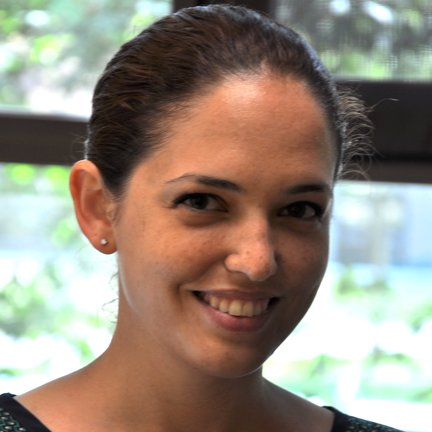

*Collective Ecophysiology and Physics of Social Insects*

[event link](https://www.crowdcast.io/e/orit-peleg-systems) | [twitter](https://twitter.com/oritpeleg) | [lab website](www.peleglab.com/)

### January 20

**Dr. Amy Toth**
*Integrative Genomics of Paper Wasp Behavior: Molecular underpinnings of complex traits and insights into social evolution*

[event link](https://www.crowdcast.io/e/amy-toth-systems) | [twitter](https://twitter.com/Amy_L_Toth) | [lab website](www.tothlab.org/)

### February 3, 2021

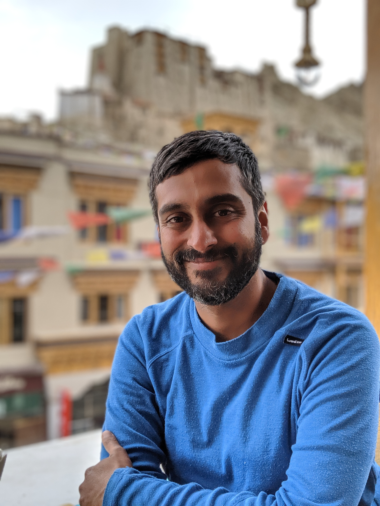

**Dr. Vivek Nityananda**
*Stereo vision and prey detection in the praying mantis*

[event link](https://www.crowdcast.io/e/vivek-nityananda-systems) | [twitter](https://twitter.com/VivekNityananda) | [lab website](https://www.worldwideneuro.com/viveknityananda.com)

### February 17, 2021

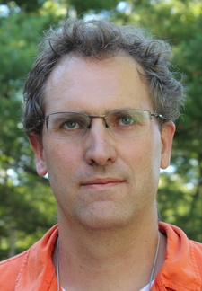

**Dr. Ben Hayden**
*Title TBD*

[event link](https://www.crowdcast.io/e/dr--ben-hayden) | [twitter](https://twitter.com/NeuroPolarbear) | [lab website](https://www.haydenlab.com/)

### March 17, 2021

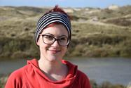

**Dr. Manon Schweinfurth**
*The evolutionary and psychological origins of reciprocal cooperation*

[event link](https://www.crowdcast.io/e/dr--manon-schweinfurth) | [twitter](https://twitter.com/ManonSchweinfu1) | [lab website](https://manon-schweinfurth.jimdofree.com/)

### March 31, 2021

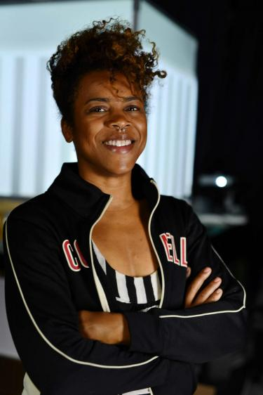

**Dr. Shaz Zamore**
*Title TBD*

[event link](https://www.crowdcast.io/e/dr--shaz-zamore-systems) | [twitter](https://twitter.com/TheDoctaZ) | [ website](https://curiousdrz.com/)

### April 28, 2021

**Dr. Megan Phifer-Rixey**
*Evolutionary genetics in wild house mice*

[event link](https://www.crowdcast.io/e/dr--megan-phifer-rixey-systems) | [twitter](https://twitter.com/RixeyMegan) | [lab website](http://phiferrixeylab.com/)

### May 26, 2021

**Dr. Kim Hoke**
*title TBD*

[event link](https://www.crowdcast.io/e/dr--kim-hoke-systems) | [twitter](https://twitter.com/HokeCSU) | [lab website](http://hokelab.weebly.com/)

## Past Speakers

Many talks are available at our [YouTube channel](link)

All talks are held Wednesdays from 12-1pm online through [World Wide Neuro](https://www.worldwideneuro.com/seminar-series.html?name=Systems_Neuroecology), links can be found below and [here](https://www.worldwideneuro.com/seminar-series.html?name=Systems_Neuroecology).

## 2020

### December 16th

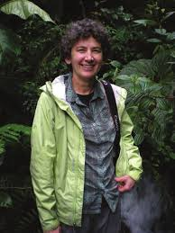

**Dr. Melissa Coleman**
*Behavioral and Neural Mechanisms of Duet Singing in a Neotropical Wren*

[event link](https://www.crowdcast.io/e/melissa-coleman-systems) | [twitter](https://twitter.com/MelColemanLab) | [lab website](https://www.kecksci.claremont.edu/faculty/profile.asp?FacultyID=179)

### December 2nd

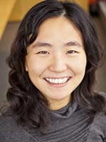

**Dr. Dayu Lin**
*Neural mechanisms of aggression*

[event link](https://www.crowdcast.io/e/dayu-lin-systems) | [twitter](https://twitter.com/moccalin) | [lab website](http://linlab.med.nyu.edu/)

### November 25th

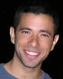

**Dr. Yossi Yovel**
*On cognitive maps and reinforcement learning in large-scale animal behavior*

[event link](https://www.crowdcast.io/e/yossi-yovel-systems) | [lab website](www.yossiyovel.com/)

### November 4th

**Dr. Eugenia Chiappe**

[event link](https://www.crowdcast.io/e/eugenia-chiappe-systems) | [twitter](https://twitter.com/EugeChapadur) | [lab website](https://chiappelab.org/)

### October 21st

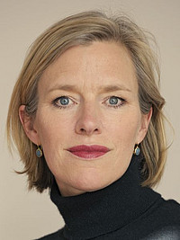

**Dr. Julia Fischer**
*Monkey Talk -- what studies about nonhuman primate vocal communication reveal about the evolution of speech*

[event link](https://www.crowdcast.io/e/julia-fischer-systems) | [twitter](https://twitter.com/julxf) | [lab website](https://www.dpz.eu/en/unit/cognitive-ethology/about-us.html)

### October 7th
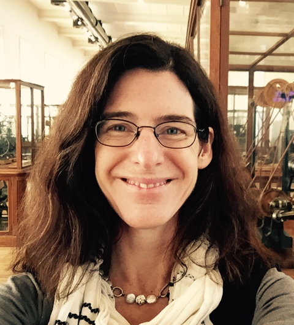

**Dr. Adrienne Fairhall**
*Reverse engineering neural control of movement in Hydra*

[event link](https://www.crowdcast.io/e/adrienne-fairhall) | [twitter](https://twitter.com/alfairhall) | [lab website](https://fairhalllab.com/)

[Dr. Piali Sengupta](https://www.worldwideneuro.com/seminar-event.html?id=521)

[Dr. Lindy McBride](https://www.worldwideneuro.com/seminar-event.html?id=520)

[Dr. Andrew Gordus](https://www.worldwideneuro.com/seminar-event.html?id=118)

[Dr. Vanessa Ruta](https://www.worldwideneuro.com/seminar-event.html?id=43)

[Dr. Benjamin de Bivort](https://www.worldwideneuro.com/seminar-event.html?id=44)

[Dr. Natasha Mhatre](https://www.worldwideneuro.com/seminar-event.html?id=131)

[Dr. Deborah Gordon](https://www.worldwideneuro.com/seminar-event.html?id=50)

[Dr. Michael Reiser](https://www.worldwideneuro.com/seminar-event.html?id=48)

[Dr. John Tuthill](https://www.worldwideneuro.com/seminar-event.html?id=47)

[Dr. Katherine Nagel](https://www.worldwideneuro.com/seminar-event.html?id=51)

## Past Seasons

Season 1: [Invertebrate Neuroecology](https://www.worldwideneuro.com/seminar-series.html?name=Invertebrate_Neuroecology) hosted by [Adam Calhoun](http://twitter.com/neuroecology)
