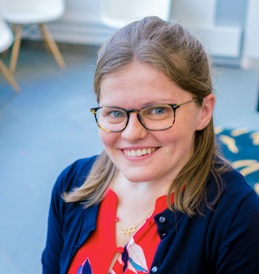

# Systems Neuroecology

We are excited to announce our [Systems Neuroecology seminar series](https://www.worldwideneuro.com/seminar-series.html?name=Systems_Neuroecology) - bringing together a community of researchers interested in questions that span behavioral ecology, ethology, and systems neuroscience! Talks take place roughly every other **Wednesday starting at 12 noon EST.**

## Organizers:
[Sama Ahmed](https://twitter.com/ColumboAhmed)

[Adam Calhoun](https://twitter.com/neuroecology)

[Emily Jane Dennis](https://twitter.com/emilyjanedennis)

[Ahmed El Hady](https://twitter.com/zamakany)

Link to YouTube channel

## Upcoming speakers
All talks are held Wednesdays from 12-1pm online through [World Wide Neuro](https://www.worldwideneuro.com/seminar-series.html?name=Systems_Neuroecology), links can be found below and [here](https://www.worldwideneuro.com/seminar-series.html?name=Systems_Neuroecology).

### October 7th
**Dr. Adrienne Fairhall**
*Title TBD*

[event link](https://www.crowdcast.io/e/adrienne-fairhall) | [twitter](https://twitter.com/alfairhall) | [lab website](https://fairhalllab.com/)

### October 21st
**Dr. Julia Fischer**
*Monkey Talk -- what studies about nonhuman primate vocal communication reveal about the evolution of speech*

[event link](https://www.crowdcast.io/e/julia-fischer-systems) | [twitter](https://twitter.com/julxf) | [lab website](https://www.dpz.eu/en/unit/cognitive-ethology/about-us.html)

### November 4th
**Dr. Eugenia Chiappe**
*Title TBD*

[event link](https://www.crowdcast.io/e/eugenia-chiappe-systems) | [twitter](https://twitter.com/EugeChapadur) | [lab website](https://chiappelab.org/)

### November 25th
**Dr. Yossi Yovel**
*On cognitive maps and reinforcement learning in large-scale animal behavior*

[event link](https://www.crowdcast.io/e/yossi-yovel-systems) | [lab website](www.yossiyovel.com/ ...)

### December 2nd
**Dr. Dayu Lin**
*Neural mechanisms of aggression*

[event link](https://www.crowdcast.io/e/dayu-lin-systems) | [twitter](https://twitter.com/moccalin) | [lab website](http://linlab.med.nyu.edu/)

### Date
**Name**
*Title TBD*

[event link](link) | [twitter](https://twitter.com/) | [lab website](https://labsite/)
### Date
**Name**
*Title TBD*

[event link](link) | [twitter](https://twitter.com/) | [lab website](https://labsite/)

## Past speakers
Many talks are available at our [YouTube channel](link)

Dr. Katherine Nagel

Dr. John Tuthill

Dr. Michael Reiser

Dr. Deborah Gordon

Dr. Natasha Mhatre

Dr. Benjamin de Bivort

Dr. Vanessa Ruta

Dr. Andrew Gordus

## Past Seasons

Season 1 (link above)
