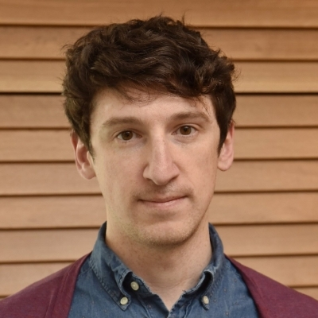

# Systems Neuroecology

Excited to announce our Systems Neuroecology seminar series - we want to bring together a community of researchers interested in questions that span behavioral ecology, ethology, and systems neuroscience!

Organizers:
[Sama Ahmed](https://twitter.com/ColumboAhmed)

[Adam Calhoun](https://twitter.com/neuroecology)

[Emily Jane Dennis](https://twitter.com/emilyjanedennis)

[Ahmed El Hady](https://twitter.com/zamakany)

Link to YouTube channel

## Upcoming speakers
Dr. Lindy McBride

Dr. Piali Sengupta

## Past speakers

Dr. Katherine Nagel

Dr. John Tuthill

Dr. Michael Reiser

Dr. Deborah Gordon

Dr. Natasha Mhatre

Dr. Benjamin de Bivort

Dr. Vanessa Ruta

Dr. Andrew Gordus

## Past Seasons

Season 1 (link above)
